# AutoEdit

A FastAPI-based video processing application that provides automated video editing capabilities through a REST API.

## Features

- **Video Processing API**: RESTful endpoint for processing video files
- **Docker Support**: Containerized deployment for easy setup and deployment
- **Environment Configuration**: Flexible configuration through environment variables

## Prerequisites

- Docker and Docker Compose installed on your system
- Video files for testing the API

## Quick Start

### 1. Environment Setup

First, configure your environment variables. Create a `.env` file in the project root and add all the required configuration values:

```bash
# Example .env file structure
# Add your specific configuration values here
API_KEY=your_api_key_here
DATABASE_URL=your_database_url
# ... other required environment variables
```

### 2. Build and Run with Docker

Build the Docker image without using cache to ensure fresh dependencies:

```bash
docker compose -f docker-compose.yml build --no-cache
```

Start the application:

```bash
docker compose -f docker-compose.yml up
```

If facing issues with Docker command:

Check entrypoint.sh - In code editor check bottom right for "CRLF" -> change it to "LF" and then save the file!
and rerun the docker command! - fix for line endings in windows

then run these commands:

```bash
docker compose down

docker compose build --no-cache

docker compose up
```

The API will be available at the configured port (typically `http://localhost:8000`).

### 3. Test the API

Test the video processing endpoint by sending a POST request to `/process-video`:

- **Endpoint**: `POST /process-video`
- **Input**: Video file and user_id parameter
- **User ID**: Use any random string as the user_id for testing purposes

#### Example API Test

```bash
curl -X POST "http://localhost:8000/process-video" \
  -H "Content-Type: multipart/form-data" \
  -F "video=@your_video_file.mp4" \
  -F "user_id=test_user_123"
```
#### Testing via Postman
POST http://localhost:8000/process-video?user_id=test_user_123
Body -> form-data
key = "file"
value = "select the input video file" ('.mp4', '.avi', '.mov', '.mkv', '.webm', '.m4v')

GET http://localhost:8000/user/test_user_123/tasks
To check the task status... Once completed this will return the google drive link for the output video!

## API Documentation

Once the application is running, you can access the interactive API documentation at:
- **Swagger UI**: `http://localhost:8000/docs`
- **ReDoc**: `http://localhost:8000/redoc`


## Function level flow diagram

```mermaid
flowchart TD
    %% Phase 1: Authentication & Upload
    A[Client Request] --> B{Authentication Check}
    B -->|get_current_user| C[JWT Token Validation]
    C --> D[User Verification]
    D --> E[File Upload Validation]
    E -->|process_video| F[File Type & Size Check]
    F --> G[Create Upload Directory]
    G --> H[Save File to Disk]
    H --> I[mongodb_manager.create_task_record]
    I --> J[Initialize Task in MongoDB]
    
    %% Phase 2: Queue Processing Worker
    J --> K[celery_app.send_task]
    K -->|Queue: processing| L[Submit to Processing Worker]
    L --> M[Return Task ID to Client]
    
    %% Phase 3: Content Processing - Processing Worker
    M --> N[AsyncVideoProcessor Initialize]
    N --> O[transcriber.transcribe_video_async]
    O --> P[FFmpeg Audio Extract]
    P --> Q{Transcription Method}
    Q -->|API| R[LemonFox Whisper API]
    Q -->|Local| S[Local Whisper Model]
    R --> T[SRT Content Generated]
    S --> T
    T --> U[summarizer.optimize_all_segments_async]
    U --> V[Azure OpenAI GPT-4]
    V --> W[AI Script Optimization]
    W --> X[generate_tts_audio_async - All Segments]
    X --> Y[Concurrent TTS Generation]
    Y --> Z[segment_audio_data Array]
    
    %% Phase 4: Queue FFmpeg Worker
    Z --> AA[send_task - process_video_with_ffmpeg]
    AA -->|Queue: ffmpeg| BB[Submit to FFmpeg Worker]
    BB --> CC[Update Status: queued_for_video_processing]
    
    %% Phase 5: Video Processing - FFmpeg Worker
    CC --> DD[extract_and_retime_segment - All Segments]
    DD --> EE[Semaphore Limit: 2 FFmpeg Processes]
    EE --> FF[Speed Calculation & Video Extract]
    FF --> GG[_robust_combine_segments_async]
    GG --> HH[FFmpeg Concat All Segments]
    HH --> II{Background Image?}
    II -->|Yes| JJ[_apply_background_async]
    II -->|No| KK[Final Video Ready]
    JJ --> KK
    
    %% Phase 6: Cloud Upload & Finalization
    KK --> LL[gdrive_uploader.upload_video_async]
    LL --> MM[Google Drive API Upload]
    MM --> NN[Resumable Upload with Progress]
    NN --> OO[Upload Success]
    OO --> PP[mongodb_manager.update_task_status - completed]
    PP --> QQ[Store Results in MongoDB]
    QQ --> RR[File Cleanup - Local & Temp Files]
    
    %% Phase 7: Status Monitoring (Parallel Process)
    M --> SS[Client Status Polling]
    SS --> TT[get_task_status API]
    TT --> UU[MongoDB + Celery Progress]
    UU --> VV[Combined Status Response]
    VV --> WW{Task Complete?}
    WW -->|No| SS
    WW -->|Yes| XX[Final Result Delivered]
    
    %% Phase 8: Error Handling (Throughout)
    YY[Error at Any Stage] --> ZZ[Exception Handling]
    ZZ --> AAA[Update Task Status: failed]
    AAA --> BBB[Cleanup Resources]
    BBB --> CCC[Error Response to Client]
    
    %% Cancellation Flow
    DDD[cancel_task Request] --> EEE[Verify User Ownership]
    EEE --> FFF[Revoke Celery Tasks]
    FFF --> GGG[Update Status: cancelled]
    GGG --> HHH[Cleanup Files & Directories]
    
    %% Styling
    classDef api fill:#3498db,stroke:#2980b9,stroke-width:2px,color:#fff
    classDef worker fill:#9b59b6,stroke:#8e44ad,stroke-width:2px,color:#fff
    classDef database fill:#34495e,stroke:#2c3e50,stroke-width:2px,color:#fff
    classDef external fill:#e67e22,stroke:#d35400,stroke-width:2px,color:#fff
    classDef error fill:#e74c3c,stroke:#c0392b,stroke-width:2px,color:#fff
    
    class C,D,E,F,G,H,M,TT,VV api
    class N,O,U,X,DD,GG,LL worker
    class I,J,PP,QQ database
    class R,V,MM external
    class YY,ZZ,AAA,BBB,CCC,DDD,EEE,FFF,GGG,HHH error
    
    %% Timeline annotations
    A -.->|0-5s| E
    E -.->|5-60s| T
    T -.->|60-120s| W
    W -.->|120-300s| Z
    Z -.->|300-600s| KK
    KK -.->|600-700s| XX
```


## Development

For development purposes, you can also run the application locally without Docker by installing the Python dependencies and running the FastAPI server directly.

## Contributing

1. Fork the repository
2. Create a feature branch
3. Make your changes
4. Submit a pull request

## License

[Add your license information here]

## Support


For issues and questions, please create an issue in the repository or contact the development team.
